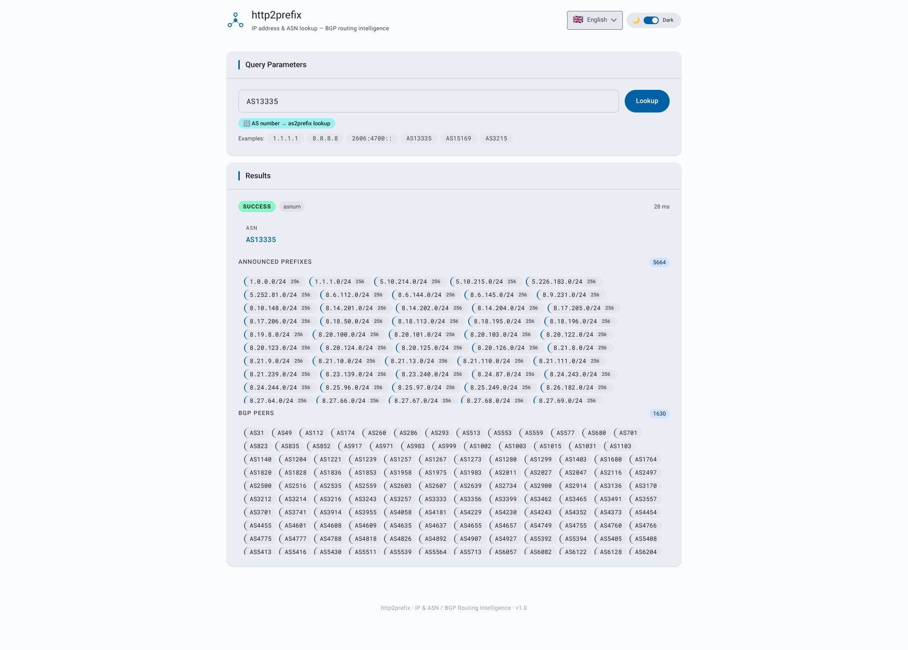

# http2prefix

[](https://opensource.org/licenses/Apache-2.0)
[](https://hub.docker.com/r/letstool/http2prefix)

> **BGP-over-HTTP** — Fast & lightweight HTTP gateway that serves Internet BGP routing database as a JSON REST API.

Given an IP address or an AS number, **http2prefix** returns the matching BGP prefix with its originating ASes, or the full list of prefixes announced by an AS — served from two in-memory MMDB databases that are refreshed automatically from a CDN.

---

## Screenshot



> The embedded web UI (served at `/`) provides an interactive form to look up IP addresses and AS numbers against the BGP routing tables. It supports **dark and light themes** and is fully translated into **15 languages**.

---

## Releases

Provided binaries are fully functional natively on Linux (amd64 or arm64), Windows (amd64), macOS (amd64 or arm64), and also via Docker (amd64 or arm64), with no additional dependencies required. For download and installation, please refer to the [Releases](https://github.com/letstool/http2prefix/releases) page.

---

## Disclaimer

This project is released **as-is**, for demonstration or reference purposes.
It is **not maintained**: no bug fixes, dependency updates, or new features are planned. Issues and pull requests will not be addressed.

---

## License

This project is licensed under the **Apache License, Version 2.0** — see the [`LICENSE`](LICENSE) file for details.

```
Copyright (c) 2026 letstool.net
```

---

## Why CDN

Rather than having every instance poll BGP data sources directly at its own schedule — placing unnecessary load on those services — `http2prefix` fetches its data from a personal CDN (`cdn.letstool.net`) that I maintain and fund myself. The data originates from public BGP routing tables; the CDN acts as a buffer, absorbing traffic so that upstream sources don't have to.

**The data itself is free.** Anyone can run `http2prefix` without a `LICENSE_KEY` and get the same routing databases, with no registration required.

---

## Features

- Single static binary — no external runtime dependencies
- Embedded web UI and OpenAPI 3.1 specification (`/openapi.json`)
- **Self-builds two MMDBs** from gzipped CSVs fetched from the **letstool CDN** — no MaxMind account required:
  - `prefix2as` — `https://cdn.letstool.net/prefix2as/csv`
  - `as2prefix` — `https://cdn.letstool.net/as2prefix/csv`
- **CDN-efficient**: uses `If-Modified-Since` / `304 Not Modified` to avoid redundant downloads when data has not changed
- **Auto-detection** — a single endpoint distinguishes IP addresses from AS numbers and routes to the appropriate database
- **MOAS support** — a prefix announced by multiple ASes (Multiple Origin AS) returns all originating AS numbers
- **IPv4 and IPv6** — both address families are fully supported in queries and results
- **Prefix size** — each result includes the number of IP addresses in the matched or announced prefix (decimal for IPv4, power-of-two notation for IPv6)
- **Clickable prefixes** — in AS results, each prefix chip is clickable and triggers an immediate prefix2as lookup on its network address
- Automatic database refresh **once per day at noon** (UTC time); scheduler adapts to CDN signals:
  - **304** — current DB kept, timestamp updated, no CDN quota consumed
  - **429** — deferred to the CDN `Retry-After` timestamp
  - **410** — retried after 24 h, 48 h, 72 h, 96 h, then stopped permanently
  - **401** — update process stopped immediately with the server's error message logged
- **`/db/prefix2as` and `/db/as2prefix` endpoints**: serve the current MMDBs for peer sync
- **MMDB format compatible with db2prefix** — databases produced by http2prefix and db2prefix are interchangeable
- Configurable listen address, database directory, peer URL, and license key
- Web UI available in **dark and light mode**, switchable at runtime
- Web UI fully translated into **15 languages**: Arabic (`ar`), Bengali (`bn`), German (`de`), English (`en`), Spanish (`es`), French (`fr`), Hindi (`hi`), Indonesian (`id`), Japanese (`ja`), Korean (`ko`), Portuguese (`pt-BR`), Russian (`ru`), Urdu (`ur`), Vietnamese (`vi`), Chinese (`zh-CN`)
- Right-to-left (RTL) layout for Arabic and Urdu, with automatic direction detection
- Docker image built on `scratch` — minimal attack surface

---

## How it works

```
Startup / Periodic update (once per day at noon, or adjusted on CDN signal)
       │
       ├── GET https://cdn.letstool.net/prefix2as/csv
       │     If-Modified-Since: <last seen>
       │     Authorization: Basic <LICENSE_KEY>  (if configured)
       │
       └── GET https://cdn.letstool.net/as2prefix/csv
             If-Modified-Since: <last seen>
             Authorization: Basic <LICENSE_KEY>  (if configured)
       │
       ├─ 304 Not Modified  → keep current DB, update timestamp, resume daily cycle
       ├─ 429 Too Many Requests → log Retry-After, defer next attempt to that timestamp
       ├─ 410 Gone          → product disabled; retry in 24h → 48h → 72h → 96h → STOP
       ├─ 401 Unauthorized  → log server message, stop update process permanently
       └─ 200 OK → gzip-decompress → parse CSV → reset 410 counter
       │
       ▼
Parse CSV rows
  prefix2as: prefix,origins              → sort prefixes by length ascending (parents first)
  as2prefix: asn,prefixes,peers,upstreams,downstreams
             → merge peers+upstreams+downstreams into one sorted set → stored as "peers"
             → sort announced prefixes (IPv4↑ then IPv6↑)
       │
       ▼
Build prefix2as.mmdb and as2prefix.mmdb via mmdbwriter (MaxMind-compatible format)
       │
       ▼
Atomic swap: serve new DBs while in-flight requests finish
       │
       ▼
POST /api/v1/asprefix
  query is IP address  → prefix2as lookup → matched prefix + originating ASes
  query is AS number   → as2prefix lookup → all announced prefixes
```

On startup, if a cached MMDB file exists on disk, it is **loaded into memory immediately** — before any CDN check — so the server is never left unresponsive while waiting for a network response. If the CDN returns 304, the already-loaded database continues to serve traffic with no interruption.

---

## Prerequisites

- [Go](https://go.dev/dl/) **1.24+**
- Outbound HTTPS access to `cdn.letstool.net` at startup and once per day at noon

---

## Build

### Native binary (Linux)

```bash
bash scripts/linux_build.sh
```

The binary is output to `./out/http2prefix`.

The script produces a **fully static binary** (no libc dependency):

```bash
CGO_ENABLED=0 go build \
    -trimpath \
    -ldflags="-extldflags -static -s -w" \
    -o ./out/http2prefix ./cmd/http2prefix
```

### Windows

```cmd
scripts\windows_build.cmd
```

### Docker image

```bash
bash scripts/docker_build.sh
```

Two-stage Docker build:
1. **Builder** — `golang:1.24-alpine` compiles a static binary
2. **Runtime** — `scratch` image, containing only the binary

The resulting image is tagged `letstool/http2prefix:latest`.

---

## Run

### Native (Linux)

```bash
bash scripts/linux_run.sh
```

### Windows

```cmd
scripts\windows_run.cmd
```

### Docker

```bash
bash scripts/docker_run.sh
```

Equivalent to:

```bash
docker run -it --rm \
  -p 8080:8080 \
  -v ./db:/data:rw \
  -e LISTEN_ADDR=0.0.0.0:8080 \
  letstool/http2prefix:latest
```

On first run, the server fetches both gzipped CSVs from the CDN, builds the MMDBs, and starts serving. This takes a few seconds. Once running, the service is available at [http://localhost:8080](http://localhost:8080).

---

## Configuration

Each setting can be provided as a CLI flag or an environment variable. The CLI flag always takes priority. Resolution order: **CLI flag → environment variable → default**.

The database refresh fires **once per day at noon** (UTC time) and is not configurable. The scheduler adapts to CDN signals: a `429` defers the next attempt to the `Retry-After` unix timestamp; a `410` triggers a progressive backoff (24 h → 48 h → 72 h → 96 h) then a permanent stop; a `401` stops the update process immediately.

| Environment variable | CLI flag | Default | Description |
|---|---|---|---|
| `LISTEN_ADDR` | `-listen-addr` | `127.0.0.1:8080` | TCP address to listen on |
| `DB_DIR` | `-db-dir` | `/data` | Directory where `prefix2as.mmdb` and `as2prefix.mmdb` are stored |
| `DB_URL` | `-db-url` | *(none)* | Base URL of a peer http2prefix instance — enables peer mode |

**Proxy environment variables** (no CLI flag — standard curl-compatible convention):

| Variable | Description |
|---|---|
| `HTTPS_PROXY` / `https_proxy` | Proxy URL for HTTPS requests (CDN and peer downloads). E.g. `http://proxy.corp:3128` or `socks5://proxy.corp:1080`. |
| `HTTP_PROXY` / `http_proxy`   | Proxy URL for plain HTTP requests. |
| `NO_PROXY` / `no_proxy`       | Comma-separated list of hosts or CIDRs to bypass the proxy (e.g. `localhost,10.0.0.0/8`). |

The proxy is configured using Go's standard `http.ProxyFromEnvironment` — identical behaviour to curl. The effective proxy URL is logged at startup.

**Examples:**

```bash
# Default mode: fetch from CDN anonymously, refresh daily at noon
./out/http2prefix -listen-addr 0.0.0.0:8080

# CDN mode through a corporate HTTP proxy
HTTPS_PROXY=http://proxy.corp:3128 ./out/http2prefix

# CDN mode through a SOCKS5 proxy
HTTPS_PROXY=socks5://proxy.corp:1080 ./out/http2prefix

# Peer mode: sync both MMDBs from an upstream instance
./out/http2prefix -db-url http://upstream-host:8080

# Using environment variables (peer mode)
DB_URL=http://upstream-host:8080 ./out/http2prefix

# Custom database directory
./out/http2prefix -db-dir /opt/bgpdb
```

---

## Database management

On startup, the server checks whether cached MMDB files exist in `DB_DIR`. If they do, they are **loaded into memory immediately**, regardless of their age, so the server is always available from the first request. A CDN check then runs to refresh stale data.

The update strategy depends on whether `DB_URL` is set:

### Mode 1 — CDN CSV build (default, `DB_URL` unset)

The server fetches gzipped CSVs from the letstool CDN for each database independently:

```
GET https://cdn.letstool.net/prefix2as/csv
GET https://cdn.letstool.net/as2prefix/csv
If-Modified-Since: <previous Last-Modified>
```

The CDN responds with:
- **200 OK** — gzipped CSV; parsed, sorted, and compiled into the corresponding MMDB. The 410 retry counter is reset.
- **304 Not Modified** — data unchanged; the in-memory DB keeps serving, timestamp updated, no CDN quota consumed
- **429 Too Many Requests** — rate-limited; the `Retry-After` header (unix timestamp) is logged; next update deferred to that timestamp
- **410 Gone** — the product is currently disabled on the CDN; the scheduler retries after 24 h, 48 h, 72 h, 96 h. If the 5th consecutive attempt still returns 410, the update process is stopped permanently. A successful 200 at any point resets the retry counter.
- **401 Unauthorized** — the `LICENSE_KEY` does not grant access to this product; the server message is logged and the update process is stopped permanently.

The `Last-Modified` value from each 200 response is stored in `.last_modified_prefix2as` / `.last_modified_as2prefix` and sent as `If-Modified-Since` on subsequent requests.

### Mode 2 — Peer sync (`DB_URL` set)

The server downloads both MMDBs directly from the `/db/prefix2as` and `/db/as2prefix` endpoints of another running `http2prefix` instance. No CDN access is needed. Useful for:
- Air-gapped or restricted environments
- High-availability clusters where only one node fetches from the CDN
- Reducing CDN quota consumption

```bash
./out/http2prefix -db-url http://upstream-host:8080
```

In both modes, databases are refreshed **once per day at noon**. Atomic hot-swap guarantees zero downtime during updates.

---

## API Reference

### `POST /api/v1/asprefix`

Resolves an IP address to its BGP prefix and originating ASes, or an AS number to all its announced prefixes.

The query type is auto-detected:
- A valid **IPv4 or IPv6 address** → `prefix2as` database lookup
- An **AS number** in the format `AS<number>` (case-insensitive: `AS13335`, `as13335`, `As13335`) → `as2prefix` database lookup

#### IP address lookup

```bash
curl -s -X POST http://localhost:8080/api/v1/asprefix \
  -H 'Content-Type: application/json' \
  -d '{"query":"1.1.1.1"}'
```

```json
{
  "status": "SUCCESS",
  "query_type": "ip",
  "query": "1.1.1.1",
  "answer": {
    "ip": "1.1.1.1",
    "prefix": "1.1.1.0/24",
    "size": "256",
    "origins": [13335]
  }
}
```

#### MOAS example (prefix announced by multiple ASes)

```bash
curl -s -X POST http://localhost:8080/api/v1/asprefix \
  -H 'Content-Type: application/json' \
  -d '{"query":"95.9.86.0"}'
```

```json
{
  "status": "SUCCESS",
  "query_type": "ip",
  "query": "95.9.86.0",
  "answer": {
    "ip": "95.9.86.0",
    "prefix": "95.9.86.0/24",
    "size": "256",
    "origins": [9121, 47331]
  }
}
```

#### AS number lookup

```bash
curl -s -X POST http://localhost:8080/api/v1/asprefix \
  -H 'Content-Type: application/json' \
  -d '{"query":"AS13335"}'
```

```json
{
  "status": "SUCCESS",
  "query_type": "asnum",
  "query": "AS13335",
  "answer": {
    "asnum": 13335,
    "prefixes": [
      {"prefix": "1.0.0.0/24",     "size": "256"},
      {"prefix": "1.1.1.0/24",     "size": "256"},
      {"prefix": "2606:4700::/32", "size": "2^96"}
    ],
    "peers": [174, 3356, 6939]
  }
}
```

#### Status values

| `status` | Meaning |
|---|---|
| `SUCCESS` | Query matched a record in the database |
| `NOTFOUND` | Query was valid but no record was found |
| `ERROR` | Malformed query, unknown format, or database not yet initialised |

#### `query_type` values

| `query_type` | Meaning |
|---|---|
| `ip` | Input was detected as an IP address; prefix2as database was queried |
| `asnum` | Input was detected as an AS number; as2prefix database was queried |
| `unknown` | Input could not be interpreted as an IP address or AS number |

### `GET /db/prefix2as`

Streams the raw `prefix2as.mmdb` binary. Used by peer instances (`DB_URL`).

### `GET /db/as2prefix`

Streams the raw `as2prefix.mmdb` binary. Used by peer instances (`DB_URL`).

---

## Response Fields

### IP address answer (`query_type: "ip"`)

| Field | Type | Description |
|---|---|---|
| `ip` | string | Input IP address in canonical form |
| `prefix` | string | Matched BGP prefix in CIDR notation |
| `size` | string | Number of addresses in the prefix — decimal for IPv4 (e.g. `"256"`), power-of-two for IPv6 (e.g. `"2^96"`) |
| `origins` | []uint32 | AS numbers originating this prefix — more than one indicates a MOAS prefix |

### AS number answer (`query_type: "asnum"`)

| Field | Type | Description |
|---|---|---|
| `asnum` | uint32 | The AS number |
| `prefixes` | []PrefixInfo | All announced prefixes, sorted: IPv4 ascending by network address, then IPv6 ascending |
| `peers` | []uint32 | Merged, deduplicated, ascending-sorted union of all BGP neighbours (peers + upstreams + downstreams). Omitted if none. |

### `PrefixInfo` object

| Field | Type | Description |
|---|---|---|
| `prefix` | string | CIDR prefix string |
| `size` | string | Number of addresses — decimal for IPv4 (e.g. `"256"`), power-of-two for IPv6 (e.g. `"2^80"`) |

**Prefix size reference:**

| Prefix length | IPv4 size | IPv6 notation |
|---|---|---|
| /8 | `16777216` | — |
| /16 | `65536` | — |
| /24 | `256` | — |
| /32 | `1` (host) | — |
| /32 (IPv6) | — | `2^96` |
| /48 | — | `2^80` |
| /64 | — | `2^64` |
| /128 | — | `1` (host) |

---

## Databases

### prefix2as — IP prefix → originating ASes

Built from `https://cdn.letstool.net/prefix2as/csv`.

CSV format: `prefix,origins` — the `origins` column contains one or more space-separated AS numbers.

Prefixes are sorted by length **ascending** (less-specific first) before insertion into the MMDB trie. This is critical for correct layering: parent prefixes must be inserted before their more-specific children, so that child records correctly override the parent when a more-specific match exists.

MMDB fields per prefix entry:

| MMDB key | Type | Description |
|---|---|---|
| `prefix` | string | Canonical CIDR prefix string |
| `origins` | []uint32 | Originating AS numbers |

DatabaseType: `db2prefix-PREFIX2AS` (interoperable with db2prefix).

### as2prefix — AS number → announced prefixes

Built from `https://cdn.letstool.net/as2prefix/csv`.

CSV format: `asn,prefixes,peers,upstreams,downstreams` — one row per AS. The `prefixes` column contains all announced prefixes space-separated on a single line. The `peers`, `upstreams`, and `downstreams` columns contain space-separated ASNs representing BGP neighbour relationships as classified by db2prefix. All three neighbour columns are merged into a single deduplicated, ascending-sorted list stored in the MMDB and returned as `peers` in the API response. Directionality (provider / customer / peer) is discarded in the merge.

ASNs are stored using a synthetic ULA IPv6 keyspace — identical to db2prefix — for full MMDB interoperability:

```
Key layout (16 bytes):
  [0-9]   = fd:ac:db:01:00:00:00:00:00:00   (fixed ULA prefix, same as db2prefix)
  [10-13] = ASN as big-endian uint32
  [14-15] = 0x00, 0x00 (zero)
  mask    = /128  (one exact address per ASN)
```

`fdac:db01::/32` is within the RFC 4193 ULA range and never routes publicly.

MMDB fields per AS entry:

| MMDB key | Type | Description |
|---|---|---|
| `asn` | uint32 | AS number |
| `prefixes` | []string | Announced prefixes, sorted: IPv4↑ then IPv6↑ |
| `peers` | []uint32 | Merged union of peers + upstreams + downstreams, sorted ascending by ASN |

DatabaseType: `db2prefix-AS2PREFIX` (interoperable with db2prefix).

---

## Development

```bash
# Tidy dependencies
bash scripts/000_init.sh

# Build native binary
bash scripts/linux_build.sh

# Run
bash scripts/linux_run.sh

# Smoke tests (server must be running on 127.0.0.1:8080)
bash scripts/999_test.sh
```

See [`CLAUDE.md`](CLAUDE.md) for full architectural details and AI-assisted development context.

---

## AI-Assisted Development

This project was developed with the assistance of **[Claude Sonnet 4.6](https://www.anthropic.com/claude)** by Anthropic.

---

## Attribution

BGP routing data sourced from public routing tables via the letstool CDN. This project is not affiliated with any RIR or BGP data provider.

“This [Product/Report] utilizes data provided by RouteViews (www.routeviews.org). Use of this data is subject to the CC BY 4.0 license.”
“With contributions from network operators and volunteers all over the world, RouteViews collects BGP data by direct peering at Internet Exchange Points (IXPs) or multi-hop peering. Data are archived and made publicly available for download at archive.routeviews.org, lg.routeviews.org, and api.routeviews.org.”

---

## See also 

| Project | GitHub | Docker Hub | Description |
|---|---|---|---|
| `http2dns` | [letstool/http2dns](https://github.com/letstool/http2dns) | [letstool/http2dns](https://hub.docker.com/r/letstool/http2dns) | Fast & lightweight HTTP gateway that serves DNS queries as a JSON REST API |
| `http2whois` | [letstool/http2whois](https://github.com/letstool/http2whois) | [letstool/http2whois](https://hub.docker.com/r/letstool/http2whois) | Fast & lightweight HTTP gateway that serves WHOIS queries as a JSON REST API |
| `http2geoip` | [letstool/http2geoip](https://github.com/letstool/http2geoip) | [letstool/http2geoip](https://hub.docker.com/r/letstool/http2geoip) | Fast & lightweight HTTP gateway that serves IP geolocation database as a JSON REST API |
| `http2cert` | [letstool/http2cert](https://github.com/letstool/http2cert) | [letstool/http2cert](https://hub.docker.com/r/letstool/http2cert) | Fast & lightweight HTTP gateway that serves X.509 certificate inspection as a JSON REST API |
| `http2tor` | [letstool/http2tor](https://github.com/letstool/http2tor) | [letstool/http2tor](https://hub.docker.com/r/letstool/http2tor) | Fast & lightweight HTTP gateway that serves Tor IP database as a JSON REST API |
| `http2sun` | [letstool/http2sun](https://github.com/letstool/http2sun) | [letstool/http2sun](https://hub.docker.com/r/letstool/http2sun) | Fast & lightweight HTTP gateway that serves solar position algorithm as a JSON REST API |
| `http2mac` | [letstool/http2mac](https://github.com/letstool/http2mac) | [letstool/http2mac](https://hub.docker.com/r/letstool/http2mac) | Fast & lightweight HTTP gateway that serves MAC address OUI database as a JSON REST API |
| `http2country` | [letstool/http2country](https://github.com/letstool/http2country) | [letstool/http2country](https://hub.docker.com/r/letstool/http2country) | Fast & lightweight HTTP gateway that serves country database as a JSON REST API |
| `http2prefix` | [letstool/http2prefix](https://github.com/letstool/http2prefix) | [letstool/http2prefix](https://hub.docker.com/r/letstool/http2prefix) | Fast & lightweight HTTP gateway that serves Internet BGP routing database as a JSON REST API |
